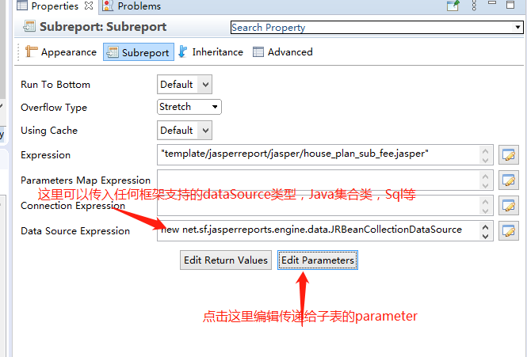
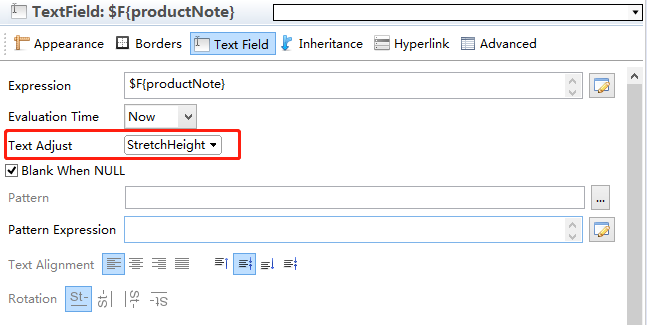

​	已经很久没有弄过jasperreport的pdf模版引擎，平时都是用itext。但使用itext只能实现一些简单样式的pdf，复杂一点的话，那简直是跟自己过不去，这种时候就还是得上模版引擎，用itext当然可以实现差不多的样式，但代码量想必是非常恐怖的。

​	在13年接触这个项目时，他还叫iReport（当年的MyBatis也还叫iBatis），编辑器也出了基于eclipse的TIBCO Jaspersoft Studio，不过界面倒是基本没变，还比以前更卡了，使用中也遇到了比较多的问题，这里记录下一些问题的解决方案

​	先讲一下jasperreport中各个band的定义，因为很多时候出现的问题都在于我们没有理解band的定义导致的

| band             | 说明                                                         |
| :--------------- | ------------------------------------------------------------ |
| Title            | title第一个可见band。 它只能创建一次，并且可以打印在单独的页面。 在设计过程中，不能超过报告页面的高度（顶部和底部）。包括底部边距）。 如果标题打印在单独的页面上，则此带高为不包括在所有带高的总和的计算中。<br/> 【注】这里说的第一是指它会在page header之前打印，你可以可以用来生成封面（通常第一页不带页眉页脚） |
| Page Header      | 可以用来实现页眉，可以根据元素大小动态调整高度。             |
| Column Header    | 默认会在每页的表格开头打印（用print when实现只打印一次），可以放置表格头。 |
| detail           | 会重复打印的数据，但注意，这里只能对dataSource循环一次，如果你的数据有嵌套层级，需要至少里外两层循环，那这里是不能直接实现的 |
| Page Footer      | 页脚                                                         |
| Last Page Footer | 顾名思义，你可以单独设置最后一页的页脚。                     |
| Summary          | 只打印一次，打印在detail后。可以放置总计计算，均值或任何你想在报告末尾包含的其他信息。而且summary是不包含header跟footer的，所以当最后一页只有summary的时候，默认是没有header与footer |

​	实际上还有其他一些band，我没有用到就不说明，想了解更多可以点击[这里](https://community.jaspersoft.com/wiki/report-structure-jaspersoft-studio)查看官方的文档。

​	总结的问题


1. title没有pageheader

   如果使用了title，你会发现页眉会打印在title下边，这就很让人抓狂。但title的定义就是在页眉前打印，jasperreport也没有提供相应的设置可以让你改变这个顺序。如果想让title也有pageheader，可以在title里手动添加页眉的元素（就是这么粗暴）。当然这种情况最好还是使用Column Header。

2. 使用外部图片

   添加图片可以使用多种方式

   - 使用项目资源路径：比如你的resource目录下有icon.png，那你可以在Express中填上“icon.png”。注意不要以“/”开头，会报找不到文件
   - 使用表达式： 表达式的结果可以是资源路径，本地/远程都可以；可以是java.awt.Image对象；可以是InputStream对象（这种方式不建议，因为流只可被读取一次，不可以循环使用，再次读取就会报错）；

3. 如何使用子表 subReport

   通常使用子表都是为了实现嵌套表格，比如单元格

   因为子表的跟主表在设计上没什么区别，这里只说下几个需要注意的问题：

   - 子表可以在模版定义时指定（使用资源相对路径，注意不能以‘’‘/’开头）；也可以使用外部变量，在程序运行时动态的指定。

   - 子表的页边距要全部设置为0，否则在插入父表的时候会出现左边跟上边的空白。设计子表时的页面大小是不重要的，需要注意的是子表的元素的宽度，如果大于父表的页宽，则会显示不全。同样的子表元素在父表中的大小也是不重要的，重要的是子表左上角的位置，这是用来定位子表位置的点。

     如下图所示，这样是不影响子表打印的

     

   - 父表可以通过parametersMap向子表传递parameter。也可在父表中指定子表的DataSource，你可以使用java的集合类作为datasource，比如

     ```
     new net.sf.jasperreports.engine.data.JRBeanCollectionDataSource($P{fees})
     ```

     这种。具体的设置界面如下图

     

4. 让图片或者多文本居中

   无论是图片还是文本，想要在container元素自动增高的情况下依然居中，前提是在设计模版的时候就保证元素已经居中了，不然你怎么设置也不可能是居中的，这点很重要。

   - 对于text field，修改图中这两个属性。Stretch Type也可以设置为ElementGroupHeight，这两个属性的区别在于一个是相对于元素所放置的Container，一个是相对于elementGroup。

   

   - 对于图片，需要多设置一项，在image tab中选择水平居中

     

5. 文本框可以自动扩展

   找到text field标签，找到Text Adjust选项，默认是cutText，设置为StretchHeight即可

   

6. 文本显示格式化

   通常我们会对像时间或者金额类型的字段进行格式化显示，那网上很多代码都是new一个format对象实现的格式化，而实际上我们并不需要这样，jasperreport本身已经内置了格式化显示机制。

   在textFiled中有个Pattern的属性，可以通过设置它来实现我们的目的。

   

   

   点击右边的按钮，会出现一个对话框，可以直接选择内置的模版，当然你也可以填写自己的模版。内置的模版有很多方便使用的功能，比如对于金额的格式化，还很贴心的提供了精度的选择。而且jasperreport会根据类型使用正确的模版，这点是自己new对象所做不到的

   

8. 使用外部字体，中文显示

   初学者一定都遇到过中文字体不显示的问题，这简直跟编码问题一样的编程届的恶心问题。而且服务器上也通常不会包含我们在设计模版时所用的字体，好在jasperreport studio还是提供了很方便的工具让我们可以使用自定义字体。
   
   具体的方式不赘述了，说下大体思路：1. 在project中导入新字体 2.对text field或者static text filed手动指定对应的字体   3.用sudio的工具导出字体包，上传到自己的私服  4.在项目中引入字体包。
   
   详细的字体的导入导出可以参考这篇文章：[JasperReport| JasperReport中使用自定义字体(font)](https://blog.csdn.net/u011479200/article/details/78607812)
   
8. 当最后一页只有summary时，header跟footer不打印
  这个问题我查了很久，最后发现在报表属性设置中就有对应的设置，勾选“Summary With Page Header And Footer”，页眉页脚就出现了

  

  可以看到这里其实还有很多很实用的设置，可以设置是否将title或者summary在单独的一页 ，这样可以设置类似卷首语，卷尾语的东西。其他的设置可以研究。